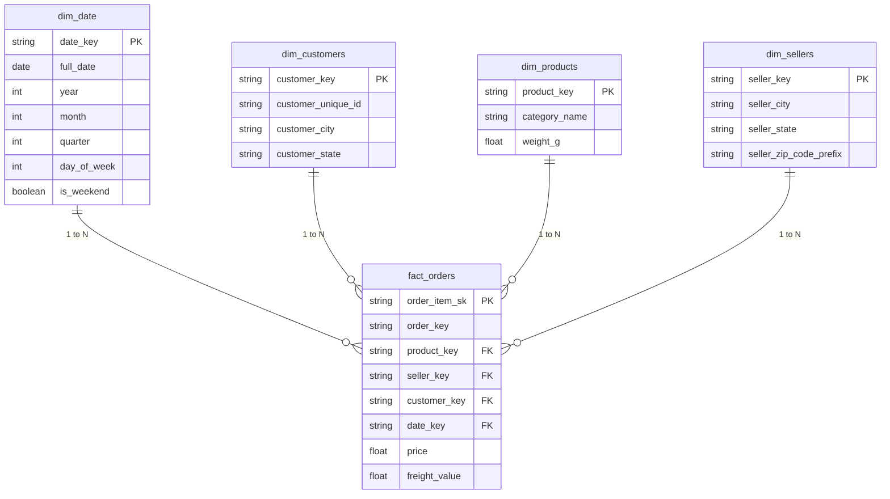

# Technical Report: Olist E-Commerce Data Pipeline

> **Project:** Brazilian E-Commerce Analytics Pipeline
> **Dataset:** [Olist Brazilian E-Commerce Dataset](https://www.kaggle.com/datasets/olistbr/brazilian-ecommerce?resource=download)

---

## Table of Contents

1. [Data Ingestion](#1-data-ingestion)
2. [Data Warehouse Design](#2-data-warehouse-design) *(lizhou)*
3. [ELT Pipeline](#3-elt-pipeline) *(Balkis)*
4. [Data Quality Testing](#4-data-quality-testing) *(qiuxuan)*
5. [Data Analysis with Python](#5-data-analysis-with-python) *(Maegala)*
6. [Pipeline Orchestration](#6-pipeline-orchestration) *(Optional)*
7. [Architecture Overview](#7-architecture-overview)

---

## 1. Data Ingestion

**Tool:** [Meltano](https://meltano.com/) v3.x
**Destination:** Google BigQuery (`olist_raw` dataset)

### 1.1 Objective

The goal of this stage is to extract raw CSV data from the Olist Kaggle dataset and load it into Google BigQuery without any transformation. This establishes a stable raw layer that all downstream pipeline stages can build upon.

### 1.2 Tool Selection: Meltano

Meltano was chosen over a custom Python script because it handles schema inference, batch uploading, and incremental state management out of the box — reducing boilerplate code and making the pipeline easier to maintain and reproduce across team members.

### 1.3 Plugin Configuration

Two Meltano plugins were used:

- **Extractor — `tap-spreadsheets-anywhere`:** Reads CSV files from local paths, automatically inferring schemas from column headers.
- **Loader — `target-bigquery`:** Writes extracted records into BigQuery tables, with each CSV mapping to one table in the `olist_raw` dataset.

### 1.4 Tables Loaded

All 8 tables were successfully loaded into `olist-assignment-497915.olist_raw`:

| Table | Description | Approx. Row Count |
|---|---|---|
| `orders` | Core order records with status and timestamps | ~99,000 |
| `customers` | Customer location and unique identifiers | ~99,000 |
| `order_items` | Line items per order (product, seller, price) | ~112,000 |
| `order_payments` | Payment method and value per order | ~103,000 |
| `order_reviews` | Customer review scores and comments | ~100,000 |
| `products` | Product metadata and category names (Portuguese) | ~33,000 |
| `sellers` | Seller location information | ~3,000 |
| `category_translation` | Portuguese → English category name mapping | ~71 |

**Total records loaded: ~550,785**

### 1.5 Raw Data Observations

Preliminary exploratory analysis (`notebooks/eda_raw_data.ipynb`) revealed the following, which downstream stages should account for:

- Timestamp columns are loaded as `STRING` type in BigQuery — these must be cast to `TIMESTAMP` in staging models.
- `order_reviews`: `review_comment_title` and `review_comment_message` contain a high proportion of NULLs (expected, as these are optional fields).
- `products`: approximately 1.6% of rows have a NULL `product_category_name`.
- `order_payments`: multiple rows per `order_id` are expected (one row per payment installment). Aggregation must be handled carefully to avoid fan-out in the fact table.
- `order_items`: the primary key is a composite of `order_id` + `order_item_id`, not `order_id` alone.
- Orders span from **September 2016 to October 2018**, with volume peaking in **late 2017 through mid-2018**.

### 1.6 Design Decision

Following the ELT pattern, raw data is loaded into BigQuery before any transformation. This preserves the original source data, allows transformations to be re-run without re-ingesting, and provides a clear audit trail for data lineage.

---

## 2. Data Warehouse Design

## 2.1 Executive Summary
In Phase 1, raw Olist e-commerce data was successfully ingested into our Google BigQuery environment (`olist_raw`). 
This notebook documents Phase 2, where we transform that raw data into a structured **Star Schema** within our Data Warehouse (`olist_dwh`). 

This architectural shift ensures our data is highly organized, strictly typed, and optimized for downstream business intelligence and analytics.


## 2.2 Project Milestones Achieved:
1. **Defined the Conceptual Architecture:** Mapped raw tables to Fact and Dimension tables.
2. **Established Data Governance:** Shifted from manual database DDL (Create Table scripts) to automated, version-controlled ELT using **dbt (Data Build Tool)**.
3. **Deployed the Data Mart:** Successfully built the core schema in BigQuery.


## 2.3 Visualizing the Architecture
A Star Schema separates business process events (Facts) from descriptive attributes (Dimensions). Below is the Entity-Relationship Diagram (ERD) defining our target architecture.




## 2.4 Schema Design Justification
When building a data system, the architecture must support the end-users (data analysts and business teams). We selected a Star Schema for the following technical and business reasons:

**Query Efficiency**: By pre-joining and flattening complex relational data into isolated dimensions, analysts can perform fast aggregations (e.g., total sales by month) without writing complex, multi-table joins.

**Data Integrity**: Surrogate and Primary Keys across our dimension tables (`dim_customers`, `dim_products`, `dim_sellers`, `dim_date`) ensure a single source of truth.

Scalability: As the Olist dataset grows, the central `fact_orders` table can scale vertically, while dimension tables handle attribute updates seamlessly.


## 2.5 Implementation Methodology (dbt)
Rather than executing manual `CREATE TABLE` statements, our team utilized dbt to manage our data transformations.

This approach abstracts the DDL logic. We write purely functional `SELECT` statements (models) in the `marts`/ folder, which pull clean data from our `staging/` layer using the `{{ ref() }}` function. dbt then automatically compiles and materializes these models as tables in BigQuery.

Below is the complete SQL implementation for our Data Warehouse, consisting of 4 Dimension tables and 1 Fact table.


### 2.5.1 Dimension Models
The dimension tables flatten descriptive attributes and establish primary keys for downstream filtering.


**1. Customers Dimension (`dim_customers.sql`)**
```SQL
{{ config(materialized='table') }}

WITH staging_customers AS (
    SELECT * FROM {{ ref('stg_customers') }}
)

SELECT
    customer_id AS customer_key,       -- Using customer_id as our primary key
    customer_unique_id,
    customer_city,
    customer_state
FROM staging_customers
```


**2. Sellers Dimension (`dim_sellers.sql`)**
```SQL
{{ config(materialized='table') }}

WITH staging_sellers AS (
    SELECT * FROM {{ ref('stg_sellers') }}
)

SELECT
    seller_id AS seller_key,           -- Using seller_id as our primary key
    seller_city,
    seller_state,
    seller_zip_code_prefix
FROM staging_sellers
```


**3. Products Dimension (`dim_products.sql`)**
```SQL
{{ config(materialized='table') }}

WITH staging_products AS (
    SELECT * FROM {{ ref('stg_products') }}
)

SELECT
    product_id AS product_key,         -- Using product_id as our primary key
    product_category_name AS category_name,
    product_weight_g AS weight_g
FROM staging_products
```


**4. Date Dimension (`dim_date.sql`)**
To support robust time-series analysis, we generated a continuous date spine covering the entire lifecycle of the Olist dataset.

```SQL
{{ config(materialized='table') }}

/* Step A: Create a "Spine" 
  We use BigQuery's built-in generator to create a continuous list of every single day 
  from January 1, 2016 to December 31, 2018.
*/
WITH date_spine AS (
    SELECT date_day
    FROM UNNEST(
        GENERATE_DATE_ARRAY(DATE('2016-01-01'), DATE('2018-12-31'), INTERVAL 1 DAY)
    ) AS date_day
)

/* Step B: Extract the details */
SELECT
    -- Turns '2018-01-15' into a clean string '20180115' to match our schema diagram
    CAST(FORMAT_DATE('%Y%m%d', date_day) AS STRING) AS date_key,
    
    date_day AS full_date,
    EXTRACT(YEAR FROM date_day) AS year,
    EXTRACT(MONTH FROM date_day) AS month,
    EXTRACT(QUARTER FROM date_day) AS quarter,
    EXTRACT(DAYOFWEEK FROM date_day) AS day_of_week,
    
    -- In BigQuery, Sunday is 1 and Saturday is 7. This checks if the day is a weekend.
    CASE
        WHEN EXTRACT(DAYOFWEEK FROM date_day) IN (1, 7) THEN TRUE 
        ELSE FALSE
    END AS is_weekend

FROM date_spine
```


### 2.5.2 Fact Model
The central fact table captures the measurable business events (order items) and maps them to our dimension keys.


**5. Fact Orders (`fact_orders.sql`)**
```SQL
{{ config(materialized='table') }}

WITH staging_order_items AS (
    SELECT * FROM {{ ref('stg_order_items') }}
),

staging_orders AS (
    SELECT * FROM {{ ref('stg_orders') }}
)

SELECT
    -- Generate a unique surrogate key for each line item
    CONCAT(i.order_id, '-', CAST(i.order_item_id AS STRING)) AS order_item_sk,

    -- Foreign Keys connecting to Dimensions
    i.order_id AS order_key,
    i.product_id AS product_key,
    i.seller_id AS seller_key,
    o.customer_id AS customer_key,

    CAST(FORMAT_DATE('%Y%m%d', DATE(o.order_purchase_timestamp)) AS STRING) AS date_key,

    -- Measurable Facts
    i.price,
    i.freight_value

FROM staging_order_items i
LEFT JOIN staging_orders o
    ON i.order_id = o.order_id
WHERE o.order_id IS NOT NULL
```


## 2.4 Deployment & Testing

To materialize this architecture in our production BigQuery environment, the following execution plan was executed via the terminal:

Test the Connection: Verified GCP Service Account permissions.
`dbt debug`

Build the Schema: Compiled the SQL and materialized the tables in BigQuery.
`dbt run --select marts`

Result: All 5 core tables (`dim_customers`, `dim_products`, `dim_sellers`, `dim_date`, `fact_orders`) were successfully created in the `olist_dwh` dataset.


---

## 3. ELT Pipeline

**Tool:** dbt Core v1.9.6  
**Warehouse:** Google BigQuery  
**Input Dataset:** `olist_raw`  
**Output Dataset:** `olist_dwh`

### 3.1 Objective

The objective of the ELT pipeline is to transform the raw Olist tables loaded into BigQuery into a clean, query-ready dimensional warehouse. The pipeline follows an ELT pattern: raw data is first loaded into BigQuery, then dbt is used to clean, standardise, validate, and model the data into staging views and star schema tables.

This phase focuses on preparing the core warehouse tables required for downstream analytics.

### 3.2 dbt Project Structure

The dbt project is organised into two main modelling layers:

```text
dbt_olist/
├── models/
│   ├── staging/
│   │   ├── stg_customers.sql
│   │   ├── stg_orders.sql
│   │   ├── stg_order_items.sql
│   │   ├── stg_payments.sql
│   │   ├── stg_products.sql
│   │   ├── stg_reviews.sql
│   │   └── stg_sellers.sql
│   └── marts/
│       ├── dim_customers.sql
│       ├── dim_products.sql
│       ├── dim_sellers.sql
│       ├── dim_date.sql
│       └── fact_orders.sql
├── sources.yml
├── schema.yml
├── dbt_project.yml
└── packages.yml
```

The final marts layer intentionally contains only the star schema models required for the warehouse design:

| Model | Type | Purpose |
|---|---|---|
| `dim_customers` | Dimension | Customer identifiers and location attributes |
| `dim_products` | Dimension | Product metadata and product attributes |
| `dim_sellers` | Dimension | Seller identifiers and location attributes |
| `dim_date` | Dimension | Calendar attributes for time-based reporting |
| `fact_orders` | Fact | Order-item level transaction table |

### 3.3 Source Configuration

The dbt source layer points to the raw BigQuery dataset:

```text
olist-assignment-497915.olist_raw
```

The following raw tables are referenced through `sources.yml`:

| Source Table | Staging Model |
|---|---|
| `customers` | `stg_customers` |
| `orders` | `stg_orders` |
| `order_items` | `stg_order_items` |
| `order_payments` | `stg_payments` |
| `products` | `stg_products` |
| `order_reviews` | `stg_reviews` |
| `sellers` | `stg_sellers` |

### 3.4 Staging Layer Transformations

The staging layer standardises raw data before it is used by the warehouse marts.

Key transformations include:

| Staging Model | Key Transformations |
|---|---|
| `stg_customers` | Trims customer IDs, standardises city/state fields, preserves `customer_unique_id` for repeat-buyer analysis |
| `stg_orders` | Trims IDs, lowercases order status, casts order timestamp columns into timestamp fields |
| `stg_order_items` | Standardises order-item level fields and casts price/freight values into numeric types |
| `stg_payments` | Standardises payment types and casts payment values/installments into numeric fields |
| `stg_products` | Cleans product IDs and product attributes such as category, dimensions, and weight |
| `stg_reviews` | Standardises review identifiers and review score fields |
| `stg_sellers` | Cleans seller IDs and standardises seller city/state fields |

These staging models are materialised as views because they are lightweight cleaning layers and should always reflect the latest raw data.

### 3.5 Star Schema Marts

The marts layer converts the cleaned staging data into a dimensional model optimised for analytics.

#### Dimension Tables

`dim_customers` contains customer-level identifiers and location fields. It retains both `customer_id` and `customer_unique_id`, allowing downstream analysts to distinguish order-level customer records from true unique customers.

`dim_products` contains product metadata such as category, product dimensions, weight, and descriptive attributes.

`dim_sellers` contains seller identifiers and seller location information.

`dim_date` is a generated calendar table covering the Olist order period. It supports time-series analysis using fields such as year, month, quarter, day of week, and weekend flag.

#### Fact Table

`fact_orders` is the central fact table. Its grain is:

```text
1 row = 1 order item
```

This grain was chosen because the Olist dataset allows one order to contain multiple products. The fact table links each order item to the customer, product, seller, and purchase date dimensions.

Core measures include:

| Measure | Description |
|---|---|
| `price` | Product sale price for the order item |
| `freight_value` | Shipping cost for the order item |

Foreign keys connect the fact table to the dimensional tables:

| Foreign Key | Dimension |
|---|---|
| `customer_key` | `dim_customers` |
| `product_key` | `dim_products` |
| `seller_key` | `dim_sellers` |
| `date_key` | `dim_date` |

### 3.6 Materialisation Strategy

| Layer | Materialisation | Rationale |
|---|---|---|
| Staging models | Views | Lightweight cleaning logic; always reflects raw source data |
| Dimension tables | Tables | Stable lookup tables used repeatedly by analysts |
| Fact table | Table | Central transaction table; materialised for faster analytical queries |

### 3.7 Data Cleaning and Validation Steps

The ELT pipeline includes the following cleaning and validation logic:

- Standardised text columns using trimming and case normalisation.
- Cast raw string timestamp fields into timestamp/date-compatible fields.
- Cast numeric fields such as price, freight, payment value, and product dimensions into numeric types.
- Filtered or flagged invalid numeric values through dbt tests.
- Enforced primary key uniqueness on key dimension tables.
- Enforced referential integrity between the fact table and dimension tables.
- Validated accepted values for fields such as order status and payment type.

### 3.8 Commands Used

The pipeline can be run from the `dbt_olist` directory using:

```bash
dbt deps
dbt parse
dbt run
dbt test
```

A successful `dbt run` builds 12 models:

| Model Type | Count |
|---|---:|
| Staging views | 7 |
| Dimension tables | 4 |
| Fact tables | 1 |
| Total models | 12 |

Recent run result:

```text
Completed successfully
Done. PASS=12 WARN=0 ERROR=0 SKIP=0 TOTAL=12
```

### 3.9 Design Decisions

| Decision | Rationale |
|---|---|
| Use dbt for transformations | Provides modular SQL models, lineage, repeatable builds, and integrated testing |
| Use staging views | Keeps raw-to-clean transformation transparent and lightweight |
| Use a star schema | Supports efficient business analysis across customers, products, sellers, and time |
| Use order-item grain for `fact_orders` | Preserves product-level sales detail and avoids losing multi-item order information |
| Keep RFM out of marts | RFM is an analytical output and is handled downstream in Python analysis rather than the core warehouse build |
| Exclude geolocation from current scope | The repeat-buyer business problem can be addressed using customers, orders, payments, and order items; geolocation can be added later for regional analysis |

### 3.10 ELT Pipeline Output

The final ELT pipeline produces a clean BigQuery warehouse in `olist_dwh`:

```text
olist_raw
   ↓
dbt staging views
   ↓
olist_dwh.dim_customers
olist_dwh.dim_products
olist_dwh.dim_sellers
olist_dwh.dim_date
olist_dwh.fact_orders
```

This warehouse provides a reliable foundation for the downstream Python analysis and executive reporting components of the project.

---
## 4. Data Quality Testing

**Tool:** [dbt Tests](https://docs.getdbt.com/docs/build/data-tests) — Built-in Generic and [dbt-expectations](https://github.com/calogica/dbt-expectations)

**Location:** `models/schema.yml`, and `tests/`

---

### 4.1 Objective

Ensure data integrity, referential consistency, and business-logic correctness across all layers of the warehouse — from staging through to the final RFM analytics mart. Tests act as automated guardrails that catch problems before bad data reaches analysts or downstream Python analysis notebooks.

---

### 4.2 Testing Framework

All tests run under a single command (`dbt test`). We use three complementary test types:
| Type | Source File | What It Validates |
|------|-------------|-------------------|
| Built-in Generic | `schema.yml` | Nulls, uniqueness, referential integrity (FK → PK) |
| dbt-expectations | `schema.yml` | Value ranges, regex patterns, data types, row counts, distributions |

#### Why Two Types?

1. **Built-in generics** are irreplaceable for `relationships` tests (foreign key validation) and provide the clearest syntax for `not_null` / `unique`.
2. **dbt-expectations** covers everything that built-in generics cannot: range checks, string patterns, statistical distribution bounds, and table-level row counts.

---

#### Why use DBT expectation over Great Expectation?
1. transformations are happening in BigQuery so we choose dbt-expectations (or dbt's built-in tests) over Great Expectations because it keeps data quality checks inside the same workflow as the transformations.
2. Benefits:
    - No data movement
    - No separate execution environment
    - Leverages BigQuery's compute engine
    - Simpler architecture

---

### 4.3 Installation

```yaml
# dbt_olist/packages.yml
packages:
- package: calogica/dbt_expectations
version: [">=0.10.0", "<0.11.0"]
dbt deps
```
4.4 Built-in Generic Tests (schema.yml) — 38 Tests
====================================================

STAGING LAYER (7 models, 13 tests)
-----------------------------------
Model              | Column              | Tests
-------------------|---------------------|---------------------------
stg_customers      | customer_id         | not_null
stg_customers      | customer_unique_id  | not_null
stg_orders         | order_id            | not_null, unique
stg_orders         | customer_id         | not_null
stg_order_items    | order_id            | not_null
stg_order_items    | product_id          | not_null
stg_order_items    | seller_id           | not_null
stg_payments       | order_id            | not_null
stg_payments       | payment_value       | not_null
stg_products       | product_id          | not_null, unique
stg_sellers        | seller_id           | not_null, unique
stg_reviews        | review_id           | not_null
stg_reviews        | order_id            | not_null

DIMENSION & FACT TABLES (5 models, 15 tests)
----------------------------------------------
Model              | Column              | Tests
-------------------|---------------------|---------------------------
dim_customers      | customer_key        | not_null, unique
dim_products       | product_key         | not_null, unique
dim_sellers        | seller_key          | not_null, unique
dim_date           | date_key            | not_null, unique
fact_orders        | order_item_sk       | not_null, unique
fact_orders        | order_key           | not_null
fact_orders        | customer_key        | not_null, relationships -> dim_customers
fact_orders        | product_key         | not_null, relationships -> dim_products
fact_orders        | seller_key          | not_null, relationships -> dim_sellers
fact_orders        | date_key            | not_null, relationships -> dim_date

4.5 dbt-expectations Tests (schema.yml) — 30 Tests
====================================================

STAGING LAYER — Type, Range & Set Validation
----------------------------------------------
Model              | Column                    | Expectation                                          | Purpose
-------------------|---------------------------|------------------------------------------------------|----------------------------------
stg_orders         | order_id                  | expect_column_values_to_be_of_type: string           | Confirms type post-ingestion
stg_orders         | order_status              | expect_column_values_to_be_in_set (8 values)         | Only valid statuses allowed
stg_orders         | order_purchase_timestamp  | expect_column_values_to_be_of_type: timestamp        | Timestamp cast succeeded
stg_payments       | payment_value             | expect_column_values_to_be_between: [0, 100000]      | No negatives or absurd values
stg_payments       | payment_type              | expect_column_values_to_be_in_set (5 values)         | Only valid payment methods
stg_payments       | payment_installments      | expect_column_values_to_be_between: [0, 24]          | Max 24 installments
stg_order_items    | price                     | expect_column_values_to_be_between: >0               | Prices must be positive
stg_order_items    | freight_value             | expect_column_values_to_be_between: >=0              | Freight never negative
stg_products       | product_weight_g          | expect_column_values_to_be_between: >0 (warn)        | Positive weight expected
stg_reviews        | review_score              | expect_column_values_to_be_between: [1, 5]           | Valid star rating

DIMENSION TABLES — Shape & Format Validation
----------------------------------------------
Model              | Column / Table            | Expectation                                          | Purpose
-------------------|---------------------------|------------------------------------------------------|----------------------------------
dim_customers      | (table)                   | expect_table_row_count_to_be_between: [90000, 110000]| No catastrophic data loss
dim_customers      | customer_state            | expect_column_value_lengths_to_equal: 2              | Brazilian state code format
dim_sellers        | (table)                   | expect_table_row_count_to_be_between: [3000, 4000]   | Expected seller population
dim_sellers        | seller_state              | expect_column_value_lengths_to_equal: 2              | State code format
dim_sellers        | seller_zip_code_prefix    | expect_column_value_lengths_to_equal: 5              | Zip prefix format
dim_date           | (table)                   | expect_table_row_count_to_equal: 1096                | Exactly 3 years, no gaps
dim_date           | date_key                  | expect_column_value_lengths_to_equal: 8              | YYYYMMDD is 8 chars
dim_date           | date_key                  | expect_column_values_to_match_regex: ^[0-9]{8}$      | Numeric format only
dim_date           | year                      | expect_column_values_to_be_in_set: [2016, 2017, 2018]| Only expected years
dim_date           | month                     | expect_column_values_to_be_between: [1, 12]          | Valid months
dim_date           | quarter                   | expect_column_values_to_be_between: [1, 4]           | Valid quarters
dim_date           | day_of_week               | expect_column_values_to_be_between: [1, 7]           | Valid day numbers

FACT & INTERMEDIATE — Value & Distribution Validation
------------------------------------------------------
Model              | Column                    | Expectation                                          | Purpose
-------------------|---------------------------|------------------------------------------------------|----------------------------------
fact_orders        | (table)                   | expect_table_row_count_to_be_between: [100000, 130000]| Row count sanity
fact_orders        | price                     | expect_column_values_to_be_between: >0               | Positive prices
fact_orders        | price                     | expect_column_mean_to_be_between: [50, 200]          | Average in expected range
fact_orders        | freight_value             | expect_column_values_to_be_between: >=0              | Non-negative freight
fact_orders        | date_key                  | expect_column_values_to_match_regex (YYYYMMDD)       | Valid date format + range


4.6 Test Organisation by Failure Domain
=========================================

    Source -> Staging -> Intermediate -> Star Schema 
              ----------------------------+---------  
                            Star schema tests          

Scenario                                   | What It Tells You
-------------------------------------------|---------------------------------------------------
Star schema tests FAIL                     | Root cause is upstream (bad source data or staging SQL)
All tests PASS                             | Pipeline is healthy and production-ready


4.7 How to Run
===============

    # Install packages
    dbt deps

    # Run all 70 tests
    dbt test

    # Run by model
    dbt test --select fact_orders
    dbt test --select fct_customer_rfm

    # Run by type
    dbt test --select test_type:generic
    dbt test --select test_type:singular


4.8 Results
============

    Completed with 0 errors, 0 warnings and 0 failures.
    Done. PASS=70  WARN=0  ERROR=0  SKIP=0  TOTAL=70

Category                              | Count
--------------------------------------|------
Built-in generic tests (schema.yml)   | 38
dbt-expectations tests (schema.yml)   | 30
TOTAL                                 | 68


4.9 Design Decisions
======================

Decision                                          | Rationale
--------------------------------------------------|--------------------------------------------------
Two test types working together                   | Each covers a different class of data defect
Built-in generics for FK validation               | relationships is irreplaceable (no dbt-expectations equivalent)
dbt-expectations for value/range rules            | Declarative YAML is easier to maintain than custom SQL
Distribution tests (mean, quantile)               | Catches subtle drift that row-level checks miss
Row count bounds on all major tables              | Smoke test against catastrophic data loss

---
## 5. Data Analysis with Python

**Tool:** Python (pandas, matplotlib, seaborn) + SQLAlchemy
**Warehouse Connection:** `bigquery://olist-assignment-497915/olist_dwh`
**Notebook:** `dbt_olist/notebooks/olist_data_analysis.ipynb`

### 5.1 Objective

The objective of this phase is to connect to the BigQuery data warehouse and perform exploratory data analysis to answer the core business question: **which customers are most likely to become repeat buyers, and how can Olist increase customer retention?** This phase consumes the star schema and RFM mart built in the ELT pipeline (Section 3) and translates them into actionable business insights, charts, and a presentation deck.

### 5.2 Connection Method

The notebook connects to BigQuery using **SQLAlchemy** with the `sqlalchemy-bigquery` dialect, authenticated via a GCP service account JSON key rather than interactive `gcloud` login. This was chosen for portability across team members' machines and to avoid requiring each analyst to set up Application Default Credentials individually.

```python
from sqlalchemy import create_engine, text
import pandas as pd

PROJECT_ID       = 'olist-assignment-497915'
DATASET          = 'olist_dwh'
CREDENTIALS_PATH = '../credentials/service_account.json'

engine = create_engine(
    f'bigquery://{PROJECT_ID}/{DATASET}',
    credentials_path=CREDENTIALS_PATH
)

def query(sql):
    with engine.connect() as conn:
        return pd.read_sql(text(sql), conn)
```

The service account key is excluded from version control via `.gitignore` and shared between team members through a private channel rather than committed to the repository.

### 5.3 Tables Consumed

This phase reads exclusively from the `olist_dwh` mart layer built in Section 3 — no raw or staging tables are queried directly.

| Table | Used For |
|---|---|
| `fact_orders` | Revenue, freight, and order-item level transactions |
| `dim_customers` | Customer unique IDs for grouping |
| `dim_date` | Year/month grouping for time-series analysis |
| `dim_products` | Category names for product analysis |
| `fct_customer_rfm` | Pre-computed RFM scores and segment labels (see Section 3.5 / 4.5) |

Note: RFM recency, frequency, monetary value, and segment labels are **not recalculated in Python**. They are computed once in the `fct_customer_rfm` dbt model (Section 3) and validated by the dbt-expectations RFM test suite (Section 4.5). This phase queries that mart directly to avoid duplicating segmentation logic in two places, ensuring the numbers shown in the analysis and the numbers validated by the test suite are guaranteed to match.

### 5.4 Analyses Performed

#### 5.4.1 Monthly Sales Trends

**Business question:** How has revenue and order volume changed month by month?

`fact_orders` is joined to `dim_date` and grouped by month to produce a time series of total revenue (`price + freight_value`) and distinct order counts.

| Metric | Value |
|---|---|
| Total revenue (Sep 2016 – Aug 2018) | R$15,843,553 |
| Peak revenue month | November 2017 — R$1,179,144 (highest month in the dataset) |
| Revenue growth | ~10x from October 2016 to October 2017 |

The sharp drop in the final month of the series reflects the boundary of the dataset (Olist released this as a fixed historical snapshot), not an actual decline in business activity.

#### 5.4.2 Top-Selling Products

**Business question:** Which product categories generate the most revenue and units sold?

`fact_orders` is joined to `dim_products` and grouped by category, ranked separately by total revenue and total items sold. Portuguese category names from the source data are mapped to English for presentation purposes.

| Rank | Category | Revenue | Items Sold | Avg Price |
|---|---|---|---|---|
| 1 | Health & Beauty | R$1,441,248 | 9,670 | R$130 |
| 2 | Watches & Gifts | R$1,305,542 | 5,991 | R$201 |
| 3 | Bed, Bath & Table | R$1,241,682 | 11,115 | R$93 |

Revenue rank and items-sold rank do not align — Bed, Bath & Table sells the most units but ranks third in revenue due to a lower average price, while Watches & Gifts ranks second in revenue with fewer units sold due to a higher average price. This indicates that category-level promotional strategy needs to account for price point, not unit volume alone.

#### 5.4.3 Customer Segmentation by Purchase Behaviour

**Business question:** Which customers are most valuable, at-risk, or likely to churn?

This analysis queries the pre-built `fct_customer_rfm` mart (Section 3.5) rather than recalculating RFM in Python. Each customer carries a `recency_days`, `frequency`, `monetary_value`, and `customer_segment` label, all validated by the dbt-expectations test suite (Section 4.5) prior to analysis.

| Segment | Customers | % of Total | Total Revenue | Avg Spend |
|---|---|---|---|---|
| At-Risk Customers | 22,596 | 23.7% | R$3,694,524 | R$163 |
| Loyal Customers | 28,479 | 29.8% | R$3,619,019 | R$127 |
| Need Attention | 18,038 | 18.9% | R$2,788,808 | R$154 |
| Promising | 15,110 | 15.8% | R$2,755,731 | R$182 |
| Champions | 6,177 | 6.5% | R$1,921,528 | R$311 |
| Potential Loyalists | 5,020 | 5.3% | R$1,063,941 | R$212 |

Average order frequency across all customers is 1.03, with 75% of customers having placed exactly one order — confirming the repeat-buyer problem stated in the original business question. Champions represent only 6.5% of customers but generate 12.1% of total revenue, while At-Risk customers represent the largest revenue exposure (23.3% of revenue, R$3.69M) at risk of permanent churn.

### 5.5 Visualisations

| Chart | Type | Purpose |
|---|---|---|
| Monthly sales trends | Dual-axis line chart | Revenue and order volume over time |
| Top products by revenue | Horizontal bar chart | Top 10 categories ranked by revenue |
| Top products by items sold | Horizontal bar chart | Top 10 categories ranked by units sold |
| Segment customer count | Horizontal bar chart | Number of customers per RFM segment |
| Segment revenue | Horizontal bar chart | Total revenue per RFM segment |
| Segment bubble chart | Scatter/bubble chart | Recency vs. average spend, bubble size = total revenue per segment |

Horizontal bar charts were used over vertical bars for all ranking visualisations because category and segment names are long and read more clearly on the y-axis. A bubble chart was used for the final segment view (in place of a recency × frequency heatmap initially drafted) because it expresses three dimensions — recency, monetary value, and total revenue — in a single plot without requiring the audience to interpret a grid of numeric scores.

### 5.6 Business Recommendations

Based on the segmentation results, three recommendations were prioritised for the stakeholder presentation:

| Priority | Recommendation | Target Segment | Rationale |
|---|---|---|---|
| 1 | Win back At-Risk customers | At-Risk Customers (22,596 / 23.7%) | Have not purchased in over 400 days, representing R$3.69M in historical revenue. Targeted win-back discount campaigns recommended. |
| 2 | Protect Champions | Champions (6,177 / 6.5%) | Generate 12.1% of total revenue at an average spend of R$311. Loyalty perks and priority service recommended to retain this disproportionately valuable segment. |
| 3 | Convert Promising customers | Promising (15,110 / 15.8%) | Purchased recently but only once. A second-purchase follow-up campaign recommended to move this segment toward Loyal Customer status. |

### 5.7 Design Decisions

| Decision | Rationale |
|---|---|
| Use SQLAlchemy instead of the native `google-cloud-bigquery` client directly | Matches the assignment specification and keeps query logic portable if the warehouse backend changes |
| Authenticate via service account key rather than `gcloud` ADC login | Simpler to distribute across team members without individual GCP CLI setup |
| Query `fct_customer_rfm` instead of recalculating RFM in pandas | Avoids duplicating segmentation logic; guarantees consistency with the dbt-expectations test suite in Section 4.5 |
| Translate Portuguese category names to English in the notebook, not in dbt | Translation is presentation-layer only and does not affect upstream modelling or tests |
| Replace the R×F heatmap with a bubble chart | Heatmap required the audience to cross-reference a numeric grid; the bubble chart communicates the same insight (recency vs. value) more intuitively for a non-technical audience |

### 5.8 Outputs

| File | Description |
|---|---|
| `olist_data_analysis.ipynb` | Main analysis notebook |
| `olist_monthly_sales.csv` | Exported monthly revenue and order counts |
| `olist_top_products.csv` | Exported top 15 categories by revenue |
| `olist_rfm_segments.csv` | Exported customer-level RFM scores and segments |


*Sections 2–7 to be completed by others*

---
